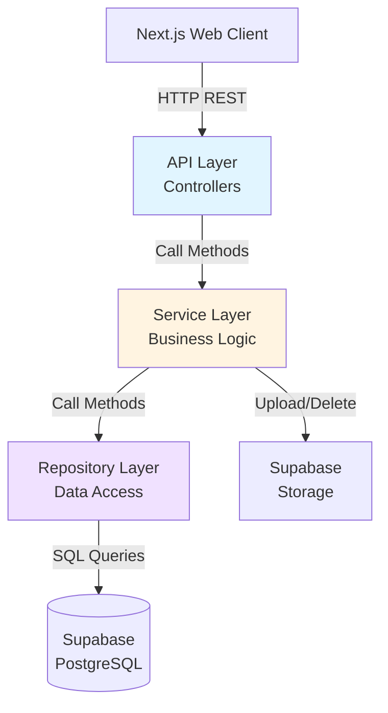
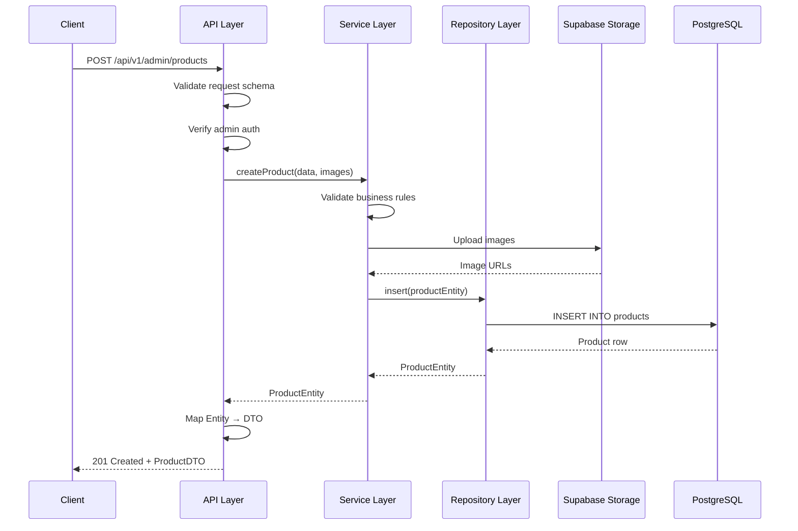
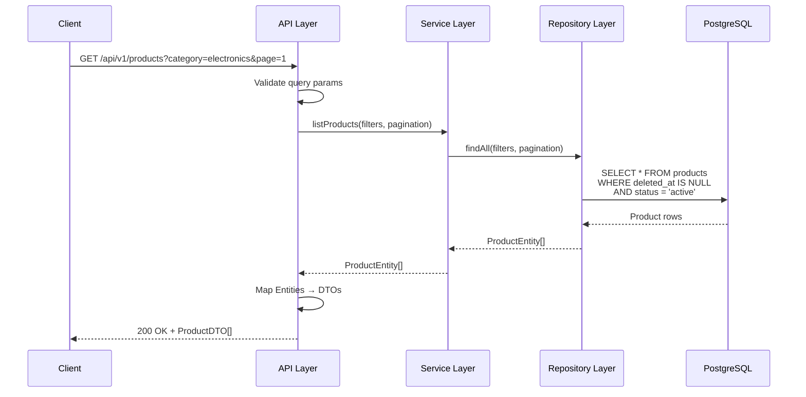

# Design Document: Product Module

## Overview

The Product Module implements a layered REST API architecture for managing product inventory in an e-commerce platform. The design enforces strict separation of concerns through three distinct layers:

- **API Layer**: HTTP request handling, validation, authentication, and response formatting
- **Service Layer**: Business logic, transaction orchestration, and authorization
- **Repository Layer**: Database access abstraction using Supabase PostgreSQL

The module exposes two API surfaces:
- **Admin API** (`/api/v1/admin/products`): Full CRUD operations requiring authentication
- **Public API** (`/api/v1/products`): Read-only access for product browsing

All responses use DTOs (Data Transfer Objects) to decouple clients from database schema changes. The system uses soft deletion to preserve historical data integrity and supports Supabase Storage for product images.

**Key Design Principles:**
- Frontend never accesses database schema directly
- All database operations flow through Repository Layer
- Business rules enforced in Service Layer
- API responses always use DTOs (Entity → DTO mapping only)
- Price stored as `numeric` in DB, returned as `number` in JSON

## Architecture

### System Context



### Layer Responsibilities

**API Layer (Controllers)**
- Route definition and HTTP method mapping
- Request validation (schema, types, required fields)
- Authentication verification (JWT tokens)
- Authorization checks (admin role)
- DTO transformation (Entity → DTO)
- HTTP status code mapping
- Error response formatting

**Service Layer**
- Business rule validation (unique names, price ranges)
- Multi-step operation orchestration (image upload + DB insert)
- Transaction coordination
- Image storage management
- Authorization logic (admin-only operations)
- Exception translation (DB errors → domain errors)

**Repository Layer**
- SQL query construction and execution
- Database connection management
- Row-to-Entity mapping
- Index management
- Soft delete filtering
- Pagination logic
- Database-specific error handling

### Data Flow

**Create Product Flow:**


**List Products Flow (Public):**


## Components and Interfaces

### API Layer Components

#### Admin Product Controller

**Endpoints:**

```typescript
POST   /api/v1/admin/products          // Create product
GET    /api/v1/admin/products          // List all products (including soft-deleted with filter)
GET    /api/v1/admin/products/:id      // Get product by ID
PUT    /api/v1/admin/products/:id      // Update product
DELETE /api/v1/admin/products/:id      // Soft delete product
```

**Request Schemas:**

```typescript
// POST /api/v1/admin/products
interface CreateProductRequest {
  name: string;              // Required, 1-200 chars
  description?: string;      // Optional, max 2000 chars
  price: number;             // Required, > 0
  category: string;          // Required
  status?: ProductStatus;    // Optional, defaults to "active"
  images?: File[];           // Optional, max 5 files, 5MB each
}

// PUT /api/v1/admin/products/:id
interface UpdateProductRequest {
  name?: string;
  description?: string;
  price?: number;
  category?: string;
  status?: ProductStatus;
  images?: File[];           // New images to add
  removeImages?: string[];   // Image IDs to remove
}

// GET /api/v1/admin/products (query params)
interface AdminListQuery {
  page?: number;             // Default: 1
  pageSize?: number;         // Default: 20, max: 100
  category?: string;
  status?: ProductStatus;
  minPrice?: number;
  maxPrice?: number;
  includeDeleted?: boolean;  // Default: false
  search?: string;           // Search in name/description
}
```

#### Public Product Controller

**Endpoints:**

```typescript
GET /api/v1/products           // List active products
GET /api/v1/products/:id       // Get product detail
```

**Request Schemas:**

```typescript
// GET /api/v1/products (query params)
interface PublicListQuery {
  page?: number;             // Default: 1
  pageSize?: number;         // Default: 20, max: 100
  category?: string;
  minPrice?: number;
  maxPrice?: number;
  search?: string;
  sortBy?: 'price' | 'name' | 'createdAt';  // Default: 'createdAt'
  sortOrder?: 'asc' | 'desc';                // Default: 'desc'
}
```

### Service Layer Components

#### ProductService

**Interface:**

```typescript
interface ProductService {
  // Admin operations
  createProduct(data: CreateProductData, images?: File[]): Promise<ProductEntity>;
  updateProduct(id: string, data: UpdateProductData, images?: File[], removeImages?: string[]): Promise<ProductEntity>;
  deleteProduct(id: string): Promise<void>;
  getProductById(id: string, includeDeleted?: boolean): Promise<ProductEntity | null>;
  listProducts(filters: ProductFilters, pagination: Pagination): Promise<PaginatedResult<ProductEntity>>;
  
  // Public operations
  getActiveProductById(id: string): Promise<ProductEntity | null>;
  listActiveProducts(filters: PublicProductFilters, pagination: Pagination): Promise<PaginatedResult<ProductEntity>>;
}

interface CreateProductData {
  name: string;
  description?: string;
  price: number;
  category: string;
  status?: ProductStatus;
}

interface UpdateProductData {
  name?: string;
  description?: string;
  price?: number;
  category?: string;
  status?: ProductStatus;
}

interface ProductFilters {
  category?: string;
  status?: ProductStatus;
  minPrice?: number;
  maxPrice?: number;
  search?: string;
  includeDeleted?: boolean;
}

interface PublicProductFilters {
  category?: string;
  minPrice?: number;
  maxPrice?: number;
  search?: string;
  sortBy?: 'price' | 'name' | 'createdAt';
  sortOrder?: 'asc' | 'desc';
}

interface Pagination {
  page: number;
  pageSize: number;
}

interface PaginatedResult<T> {
  data: T[];
  total: number;
  page: number;
  pageSize: number;
  totalPages: number;
}
```

**Business Rules:**
- Product names must be unique within the same category
- Price must be greater than 0
- Image files must be JPEG, PNG, or WebP
- Image files must not exceed 5MB each
- Maximum 5 images per product
- Status defaults to "active" on creation
- Soft delete sets `deleted_at` timestamp

#### ImageStorageService

**Interface:**

```typescript
interface ImageStorageService {
  uploadImage(file: File, productId: string): Promise<string>;  // Returns image URL
  deleteImage(imageUrl: string): Promise<void>;
  generateUniqueFilename(originalName: string): string;
  validateImageFile(file: File): void;  // Throws if invalid
}
```

### Repository Layer Components

#### ProductRepository

**Interface:**

```typescript
interface ProductRepository {
  insert(product: ProductEntity): Promise<ProductEntity>;
  update(id: string, updates: Partial<ProductEntity>): Promise<ProductEntity>;
  softDelete(id: string): Promise<void>;
  findById(id: string, includeDeleted?: boolean): Promise<ProductEntity | null>;
  findAll(filters: RepositoryFilters, pagination: Pagination): Promise<PaginatedResult<ProductEntity>>;
  existsByNameAndCategory(name: string, category: string, excludeId?: string): Promise<boolean>;
}

interface RepositoryFilters {
  category?: string;
  status?: ProductStatus;
  minPrice?: number;
  maxPrice?: number;
  search?: string;
  includeDeleted?: boolean;
  sortBy?: string;
  sortOrder?: 'asc' | 'desc';
}
```

**Query Patterns:**

```sql
-- List products with filters
SELECT * FROM products
WHERE deleted_at IS NULL
  AND ($1::text IS NULL OR category = $1)
  AND ($2::text IS NULL OR status = $2)
  AND ($3::numeric IS NULL OR price >= $3)
  AND ($4::numeric IS NULL OR price <= $4)
  AND ($5::text IS NULL OR (name ILIKE $5 OR description ILIKE $5))
ORDER BY created_at DESC
LIMIT $6 OFFSET $7;

-- Check unique name in category
SELECT EXISTS(
  SELECT 1 FROM products
  WHERE name = $1
    AND category = $2
    AND deleted_at IS NULL
    AND ($3::uuid IS NULL OR id != $3)
);

-- Soft delete
UPDATE products
SET deleted_at = NOW()
WHERE id = $1 AND deleted_at IS NULL;
```

## Data Models

### Database Schema

**products table:**

```sql
CREATE TABLE products (
  id UUID PRIMARY KEY DEFAULT gen_random_uuid(),
  name TEXT NOT NULL,
  description TEXT,
  price NUMERIC(10, 2) NOT NULL CHECK (price > 0),
  category TEXT NOT NULL,
  status TEXT NOT NULL CHECK (status IN ('active', 'inactive', 'out_of_stock')),
  images JSONB DEFAULT '[]'::jsonb,
  created_at TIMESTAMPTZ NOT NULL DEFAULT NOW(),
  updated_at TIMESTAMPTZ NOT NULL DEFAULT NOW(),
  deleted_at TIMESTAMPTZ
);

-- Indexes for query optimization
CREATE INDEX idx_products_category ON products(category) WHERE deleted_at IS NULL;
CREATE INDEX idx_products_status ON products(status) WHERE deleted_at IS NULL;
CREATE INDEX idx_products_created_at ON products(created_at DESC) WHERE deleted_at IS NULL;
CREATE INDEX idx_products_deleted_at ON products(deleted_at) WHERE deleted_at IS NOT NULL;
CREATE INDEX idx_products_price ON products(price) WHERE deleted_at IS NULL;
CREATE INDEX idx_products_search ON products USING gin(to_tsvector('english', name || ' ' || COALESCE(description, '')));

-- Unique constraint for name within category (excluding soft-deleted)
CREATE UNIQUE INDEX idx_products_unique_name_category 
ON products(name, category) 
WHERE deleted_at IS NULL;

-- Trigger to auto-update updated_at
CREATE OR REPLACE FUNCTION update_updated_at_column()
RETURNS TRIGGER AS $$
BEGIN
  NEW.updated_at = NOW();
  RETURN NEW;
END;
$$ LANGUAGE plpgsql;

CREATE TRIGGER update_products_updated_at
BEFORE UPDATE ON products
FOR EACH ROW
EXECUTE FUNCTION update_updated_at_column();
```

**images JSONB structure:**

```json
[
  {
    "id": "uuid-v4",
    "url": "https://supabase-storage-url/products/uuid-filename.jpg",
    "filename": "uuid-filename.jpg",
    "order": 0
  }
]
```

### Domain Models

**ProductEntity:**

```typescript
interface ProductEntity {
  id: string;                    // UUID
  name: string;
  description: string | null;
  price: number;                 // Stored as numeric in DB
  category: string;
  status: ProductStatus;
  images: ProductImage[];
  createdAt: Date;
  updatedAt: Date;
  deletedAt: Date | null;
}

type ProductStatus = 'active' | 'inactive' | 'out_of_stock';

interface ProductImage {
  id: string;
  url: string;
  filename: string;
  order: number;
}
```

**ProductDTO (API Response):**

```typescript
interface ProductDTO {
  id: string;
  name: string;
  description: string | null;
  price: number;
  category: string;
  status: ProductStatus;
  images: ProductImageDTO[];
  createdAt: string;             // ISO 8601 format
  updatedAt: string;             // ISO 8601 format
}

interface ProductImageDTO {
  id: string;
  url: string;                   // Full public URL
  order: number;
}
```

**DTO Mapping Logic:**

```typescript
function mapEntityToDTO(entity: ProductEntity): ProductDTO {
  return {
    id: entity.id,
    name: entity.name,
    description: entity.description,
    price: entity.price,
    category: entity.category,
    status: entity.status,
    images: entity.images.map(img => ({
      id: img.id,
      url: img.url,  // Already full URL from storage
      order: img.order
    })),
    createdAt: entity.createdAt.toISOString(),
    updatedAt: entity.updatedAt.toISOString()
  };
}
```

**Note:** DTO mapping is unidirectional (Entity → DTO only). Client requests use separate request schemas, not DTOs.

### Folder Structure

```
apps/api/src/
├── modules/
│   └── products/
│       ├── controllers/
│       │   ├── admin-product.controller.ts
│       │   └── public-product.controller.ts
│       ├── services/
│       │   ├── product.service.ts
│       │   └── image-storage.service.ts
│       ├── repositories/
│       │   └── product.repository.ts
│       ├── dto/
│       │   ├── product.dto.ts
│       │   ├── create-product.request.ts
│       │   └── update-product.request.ts
│       ├── entities/
│       │   └── product.entity.ts
│       └── types/
│           └── product.types.ts
├── common/
│   ├── middleware/
│   │   ├── auth.middleware.ts
│   │   └── error-handler.middleware.ts
│   ├── exceptions/
│   │   ├── validation.exception.ts
│   │   ├── not-found.exception.ts
│   │   └── unauthorized.exception.ts
│   └── utils/
│       └── pagination.util.ts
└── config/
    ├── supabase.config.ts
    └── storage.config.ts
```


## Correctness Properties

*A property is a characteristic or behavior that should hold true across all valid executions of a system—essentially, a formal statement about what the system should do. Properties serve as the bridge between human-readable specifications and machine-verifiable correctness guarantees.*

### Property 1: Filter Correctness

*For any* combination of filters (category, price range, status) applied to a product query, all returned products SHALL match ALL specified filter criteria.

**Validates: Requirements 2.2, 5.3, 5.4**

### Property 2: Public API Exclusion of Deleted and Inactive Products

*For any* product with `deleted_at IS NOT NULL` OR `status != "active"`, the Public API SHALL never return that product in listing or detail responses.

**Validates: Requirements 4.3, 5.6**

### Property 3: DTO Mapping Correctness

*For any* valid `ProductEntity`, mapping to `ProductDTO` SHALL produce a valid DTO with all required fields correctly transformed (dates to ISO 8601, images to full URLs, price as number).

**Validates: Requirements 7.1, 16.1**

### Property 4: DTO Internal Field Exclusion

*For any* `ProductEntity` (including those with `deleted_at` set), the resulting `ProductDTO` SHALL never include internal database fields (`deleted_at`, database-specific metadata).

**Validates: Requirements 7.2**

### Property 5: DTO CamelCase Naming Convention

*For any* `ProductDTO` object, all field names SHALL follow camelCase convention (first letter lowercase, subsequent words capitalized).

**Validates: Requirements 7.4**

### Property 6: Repository Row-to-Entity Mapping

*For any* valid database row from the products table, mapping to `ProductEntity` SHALL produce a valid entity object with all fields correctly typed and parsed.

**Validates: Requirements 8.4**

### Property 7: Filename Uniqueness

*For any* set of image uploads (even with identical original filenames), the generated storage filenames SHALL be unique to prevent collisions.

**Validates: Requirements 11.2**

### Property 8: Image File Validation

*For any* uploaded file, validation SHALL correctly accept files that are JPEG/PNG/WebP under 5MB and reject all other files with appropriate error messages.

**Validates: Requirements 11.3**

### Property 9: Error Response Format Consistency

*For any* error condition (validation, authentication, authorization, not found, server error), the API response SHALL follow the consistent error format structure: `{ "error": { "code": string, "message": string, "fields"?: array } }`.

**Validates: Requirements 12.6**

### Property 10: ISO 8601 Timestamp Formatting

*For any* timestamp field in API responses (`createdAt`, `updatedAt`), the value SHALL be formatted as a valid ISO 8601 string.

**Validates: Requirements 14.3**

### Property 11: DTO Mapper Error Handling

*For any* invalid `ProductEntity` (missing required fields like `name`, `price`, `status`), the DTO mapper SHALL throw a descriptive error indicating which field is invalid.

**Validates: Requirements 16.2**

### Property 12: DTO Mapper Null Handling

*For any* `ProductEntity` with null optional fields (`description`, `deletedAt`), the DTO mapper SHALL correctly handle these nulls without throwing errors and include them appropriately in the DTO.

**Validates: Requirements 16.3**

### Property 13: Sort Order Correctness

*For any* sort field (`price`, `name`, `createdAt`) and sort order (`asc`, `desc`), the returned product list SHALL be correctly ordered according to the specified criteria.

**Validates: Requirements 5.5**

### Property 14: Search Result Relevance

*For any* search query string, all returned products SHALL contain the search term in either the product name or description (case-insensitive).

**Validates: Requirements 5.2**

## Error Handling

### Error Response Format

All API errors follow a consistent structure:

```typescript
interface ErrorResponse {
  error: {
    code: string;           // Machine-readable error code
    message: string;        // Human-readable error message
    fields?: FieldError[];  // Optional field-specific errors
  };
}

interface FieldError {
  field: string;
  message: string;
}
```

### HTTP Status Code Mapping

| Status Code | Error Type | Example Scenarios |
|-------------|------------|-------------------|
| 400 Bad Request | Validation Error | Missing required fields, invalid price, invalid file type |
| 401 Unauthorized | Authentication Error | Missing JWT token, expired token, invalid token |
| 403 Forbidden | Authorization Error | Non-admin accessing admin endpoints |
| 404 Not Found | Resource Not Found | Product ID doesn't exist, soft-deleted product, inactive product (public API) |
| 409 Conflict | Business Rule Violation | Duplicate product name in category |
| 500 Internal Server Error | Server Error | Database connection failure, unexpected exceptions |

### Error Handling Strategy by Layer

**API Layer:**
- Validates request schemas (Zod, Joi, or similar)
- Catches all exceptions from Service Layer
- Maps exceptions to appropriate HTTP status codes
- Formats error responses consistently
- Logs errors with request context
- Never exposes internal implementation details in error messages

**Service Layer:**
- Throws domain-specific exceptions (e.g., `ProductNotFoundError`, `DuplicateProductError`)
- Validates business rules before calling Repository Layer
- Wraps repository exceptions in domain exceptions
- Handles transaction rollback on errors
- Logs business rule violations

**Repository Layer:**
- Catches database-specific errors (Supabase/PostgreSQL errors)
- Translates to domain exceptions (e.g., unique constraint violation → `DuplicateProductError`)
- Logs database errors with query context
- Never exposes SQL or database internals to upper layers

### Example Error Responses

**Validation Error (400):**
```json
{
  "error": {
    "code": "VALIDATION_ERROR",
    "message": "Invalid product data",
    "fields": [
      {
        "field": "price",
        "message": "Price must be greater than 0"
      },
      {
        "field": "name",
        "message": "Name is required"
      }
    ]
  }
}
```

**Authentication Error (401):**
```json
{
  "error": {
    "code": "UNAUTHORIZED",
    "message": "Authentication required. Please provide a valid access token."
  }
}
```

**Authorization Error (403):**
```json
{
  "error": {
    "code": "FORBIDDEN",
    "message": "Admin access required for this operation."
  }
}
```

**Not Found Error (404):**
```json
{
  "error": {
    "code": "PRODUCT_NOT_FOUND",
    "message": "Product with ID '123e4567-e89b-12d3-a456-426614174000' not found."
  }
}
```

**Conflict Error (409):**
```json
{
  "error": {
    "code": "DUPLICATE_PRODUCT",
    "message": "A product with name 'iPhone 15' already exists in category 'Electronics'."
  }
}
```

**Server Error (500):**
```json
{
  "error": {
    "code": "INTERNAL_SERVER_ERROR",
    "message": "An unexpected error occurred. Please try again later."
  }
}
```

### Error Logging

- **API Layer**: Log all 4xx and 5xx responses with request ID, endpoint, user ID
- **Service Layer**: Log business rule violations and transaction failures
- **Repository Layer**: Log database errors with sanitized query information
- **Never log**: Sensitive data (passwords, tokens), full stack traces in production

## Testing Strategy

### Testing Approach

The Product Module requires a **dual testing approach** combining property-based tests for universal correctness properties with example-based tests for specific scenarios and integration tests for external dependencies.

### Property-Based Testing

**Framework:** fast-check (TypeScript/JavaScript property-based testing library)

**Configuration:**
- Minimum 100 iterations per property test
- Each test tagged with: `Feature: product-module, Property {number}: {property_text}`

**Property Tests to Implement:**

1. **Filter Correctness** (Property 1)
   - Generate: Random product lists, random filter combinations
   - Verify: All returned products match ALL filter criteria
   - Tag: `Feature: product-module, Property 1: Filter Correctness`

2. **Public API Exclusion** (Property 2)
   - Generate: Random product lists with various statuses and deleted_at values
   - Verify: Public API never returns deleted or inactive products
   - Tag: `Feature: product-module, Property 2: Public API Exclusion of Deleted and Inactive Products`

3. **DTO Mapping Correctness** (Property 3)
   - Generate: Random valid ProductEntity objects
   - Verify: Mapping produces valid ProductDTO with correct transformations
   - Tag: `Feature: product-module, Property 3: DTO Mapping Correctness`

4. **DTO Internal Field Exclusion** (Property 4)
   - Generate: Random ProductEntity objects (including with deleted_at)
   - Verify: ProductDTO never includes deleted_at or internal fields
   - Tag: `Feature: product-module, Property 4: DTO Internal Field Exclusion`

5. **DTO CamelCase Naming** (Property 5)
   - Generate: Random ProductDTO objects
   - Verify: All field names are camelCase
   - Tag: `Feature: product-module, Property 5: DTO CamelCase Naming Convention`

6. **Repository Row Mapping** (Property 6)
   - Generate: Random database row objects
   - Verify: Mapping produces valid ProductEntity
   - Tag: `Feature: product-module, Property 6: Repository Row-to-Entity Mapping`

7. **Filename Uniqueness** (Property 7)
   - Generate: Multiple uploads with same original filename
   - Verify: All generated filenames are unique
   - Tag: `Feature: product-module, Property 7: Filename Uniqueness`

8. **Image File Validation** (Property 8)
   - Generate: Random files with various types and sizes
   - Verify: Validation correctly accepts/rejects based on rules
   - Tag: `Feature: product-module, Property 8: Image File Validation`

9. **Error Response Consistency** (Property 9)
   - Generate: Various error conditions
   - Verify: All error responses follow consistent format
   - Tag: `Feature: product-module, Property 9: Error Response Format Consistency`

10. **ISO 8601 Timestamp Formatting** (Property 10)
    - Generate: Random dates
    - Verify: All formatted as valid ISO 8601 strings
    - Tag: `Feature: product-module, Property 10: ISO 8601 Timestamp Formatting`

11. **DTO Mapper Error Handling** (Property 11)
    - Generate: Invalid ProductEntity objects (missing required fields)
    - Verify: Mapper throws descriptive errors
    - Tag: `Feature: product-module, Property 11: DTO Mapper Error Handling`

12. **DTO Mapper Null Handling** (Property 12)
    - Generate: ProductEntity with various null optional fields
    - Verify: Mapper handles nulls correctly
    - Tag: `Feature: product-module, Property 12: DTO Mapper Null Handling`

13. **Sort Order Correctness** (Property 13)
    - Generate: Random product lists, random sort criteria
    - Verify: Results correctly ordered
    - Tag: `Feature: product-module, Property 13: Sort Order Correctness`

14. **Search Result Relevance** (Property 14)
    - Generate: Random search terms, random product lists
    - Verify: All results contain search term
    - Tag: `Feature: product-module, Property 14: Search Result Relevance`

### Example-Based Unit Tests

**Focus Areas:**
- Specific validation rules (missing name, negative price, invalid status)
- Authentication/authorization checks (missing token, non-admin access)
- Default values (status defaults to "active")
- Pagination configuration (default page size, max page size)
- HTTP status code mapping (404 for not found, 401 for auth failure)
- Soft delete behavior (deleted_at set, data preserved)
- Error response formatting (specific error codes and messages)

**Example Test Cases:**
- Create product without name → 400 with field error
- Create product without auth → 401
- Update non-existent product → 404
- Delete product → deleted_at set, data preserved
- Request deleted product via public API → 404
- Admin request with includeDeleted=true → returns deleted products
- Pagination with pageSize > 100 → capped at 100
- Create product without status → defaults to "active"

### Integration Tests

**Focus Areas:**
- Full API request/response flows
- Database operations (create, read, update, soft delete)
- Supabase Storage integration (image upload, deletion)
- Transaction behavior (rollback on failure)
- Authentication middleware integration
- Rate limiting enforcement

**Example Integration Tests:**
- POST /api/v1/admin/products with images → product created, images uploaded
- PUT /api/v1/admin/products/:id with new images → images uploaded, references updated
- DELETE /api/v1/admin/products/:id → soft delete, public API excludes it
- GET /api/v1/products with filters → correct products returned
- Duplicate product name in category → 409 conflict
- Multi-step operation failure → transaction rollback

### Smoke Tests

**Focus Areas:**
- Database schema validation
- Index existence
- Enum definitions
- Connection pooling configuration

**Example Smoke Tests:**
- Verify products table has all required columns
- Verify indexes exist on category, status, created_at, deleted_at
- Verify ProductStatus enum has correct values
- Verify Supabase client uses connection pooling

### Test Coverage Goals

- **Property-based tests**: 100% coverage of universal correctness properties
- **Unit tests**: 90%+ coverage of business logic and validation
- **Integration tests**: All API endpoints and external integrations
- **Smoke tests**: All infrastructure and schema requirements

### Testing Tools

- **Property-based testing**: fast-check
- **Unit testing**: Jest or Vitest
- **Integration testing**: Supertest (API testing) + Supabase test client
- **Mocking**: Mock Supabase client for unit tests, use test database for integration tests
- **Coverage**: Istanbul/nyc

### Test Execution Strategy

1. **Development**: Run unit tests and property tests on every save
2. **Pre-commit**: Run all unit tests and property tests
3. **CI/CD**: Run full test suite (unit + property + integration + smoke)
4. **Property test failures**: Log failing examples for debugging and regression tests

