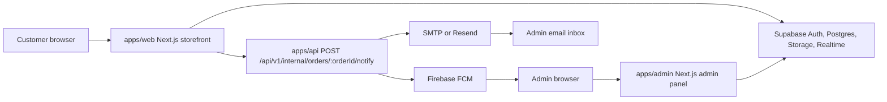
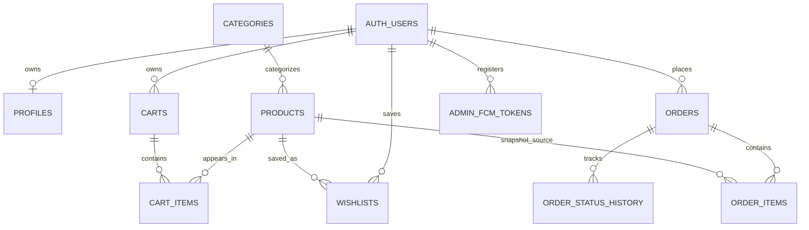
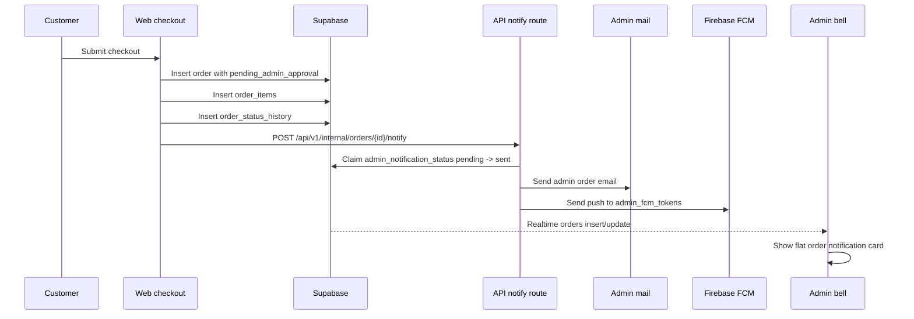

# Architecture

## System Overview

The storefront reads live products, blogs, categories, coupons, cart data, and customer orders from Supabase. Checkout currently writes orders, order items, payment proof metadata, and order history directly to Supabase, then calls the API internal notify route.

The admin panel uses Supabase Auth plus role checks in `profiles`. Most admin workflows are implemented as Next.js server actions using a Supabase service client. The API remains the typed REST surface for products, carts, orders, profiles, admin stats, and internal notifications.

## Database Schema Summary

| Table | Key columns | Relationships and notes |
| --- | --- | --- |
| `products` | `id`, `name`, `description`, `price`, `category`, `status`, `images`, `storefront_data`, `publishing_status`, `category_id`, `deleted_at` | `category_id` references `categories.id`; `images` is JSONB; `status` includes `active`, `inactive`, `out_of_stock`, `low_stock`; `publishing_status` is `draft` or `live`; unique live storefront slug index on `storefront_data->>'slug'`. |
| `categories` | `id`, `name`, `slug`, `description`, `is_active`, `sort_order` | Product authoring taxonomy. Public can read active categories; admins manage all. |
| `profiles` | `id`, `email`, `full_name`, `role`, `avatar_url`, `username`, `staff_permissions` | `id` references `auth.users.id`; role is `customer`, `staff`, or `admin`; signup trigger creates/repairs profiles. |
| `carts` | `id`, `user_id`, `session_id`, `created_at`, `updated_at` | One cart per authenticated user or guest session; `user_id` references `auth.users.id`. |
| `cart_items` | `id`, `cart_id`, `product_id`, `quantity`, `price_at_addition` | `cart_id` references `carts.id`; `product_id` references `products.id`; unique product per cart. |
| `wishlists` | `id`, `user_id`, `product_id`, `created_at` | `user_id` references `auth.users.id`; `product_id` references `products.id`; one saved product per user. |
| `orders` | `id`, `user_id`, `order_number`, `status`, customer fields, shipping fields, totals, `payment_method`, `payment_status`, proof fields, coupon fields, `admin_notification_status`, `admin_notes` | `user_id` references `auth.users.id`; supports `pending_admin_approval`, `fonepay_qr`, `pending_verification`, coupon discount persistence, and admin notification claim state. |
| `order_items` | `id`, `order_id`, `product_id`, `product_name`, `product_image_url`, `product_slug`, `quantity`, `unit_price`, `total_price` | `order_id` references `orders.id`; `product_id` references `products.id` with `ON DELETE SET NULL`. |
| `order_status_history` | `id`, `order_id`, `status`, `notes`, `changed_by`, `created_at` | `order_id` references `orders.id`; `changed_by` references `auth.users.id`. |
| `blog_posts` | `id`, `slug`, `title`, `excerpt`, `category`, `cover_image_url`, `author`, `status`, `featured`, `tags`, `seo_title`, `seo_description`, `content`, `deleted_at` | Public reads published non-deleted posts; admins manage all. |
| `storefront_sections` | `key`, `slugs`, `created_at`, `updated_at` | Curated homepage/storefront product sections stored as JSONB slug arrays. |
| `coupons` | `id`, `code`, `discount_type`, `discount_value`, `max_discount_amount`, `is_active`, dates, applicability arrays, usage counters, `archived_at` | Public read for validation; admins manage; `orders` stores `coupon_code`, `discount_amount`, `original_subtotal`; usage increments during order insert. |
| `admin_access_grants` | `id`, `email`, `username`, `role`, `granted_by`, `accepted_user_id`, `accepted_at` | Super-admin managed grants for staff/admin setup. |
| `admin_access_requests` | `id`, `email`, `user_id`, `status`, `created_at` | Records setup requests pending/reviewed/approved/rejected. |
| `admin_email_otp_challenges` | `id`, `email`, `purpose`, `otp_hash`, `expires_at`, `consumed_at`, `attempts`, `max_attempts` | Setup OTP challenges for `new_user_setup`; service role manages rows. |
| `admin_fcm_tokens` | `id`, `admin_user_id`, `token`, `created_at`, `updated_at` | Admin browser FCM tokens; `admin_user_id` references `auth.users.id`; unique token. |

## Relationships

## Auth Flow

### Customer Auth

1. Customers use Supabase Auth through `@dakshinkali/auth`.
2. Browser clients use `NEXT_PUBLIC_SUPABASE_URL` and anon or publishable keys.
3. Login/signup routes are in `apps/web/app/login`, `apps/web/app/signup`, and `apps/web/app/auth/callback`.
4. A database trigger creates a `profiles` row for each new `auth.users` row.
5. Customer RLS policies allow users to manage their own profiles, carts, wishlists, and orders.

### Admin Auth

1. Admins sign in at `apps/admin/app/login`.
2. Existing admin/staff accounts use Supabase password login with email or username.
3. `requireAdminUser()` checks the Supabase session and verifies `profiles.role` through `isAdminRole`.
4. New granted staff/admin setup uses `/admin/setup-access`, `admin_access_grants`, and a 6-digit email OTP challenge.
5. OTP hashes are stored in `admin_email_otp_challenges`; email delivery supports mock, Resend, or SMTP.
6. `is_admin()`, `is_admin_or_staff()`, and `is_super_admin()` power RLS and admin access workflows.

## Storage

| Bucket | Public | Stored files | Policies |
| --- | --- | --- | --- |
| `product-images` | Yes | Product images uploaded by admins and referenced in product JSONB image metadata. | Admin insert/update/delete, public select. |
| `blog-images` | Yes | Blog cover images from the admin blog editor. | Admin insert/update/delete, public select. |
| `order-proofs` | Yes | Customer/admin uploaded Fonepay or QR payment proof files: JPEG, PNG, WebP, PDF up to 5 MB. | Public select; authenticated customers insert under `orders/{userId}/...`; admins can upload/read. |

## Order Flow

## Payment Flows

### Cash on Delivery

1. Customer selects COD in checkout.
2. Storefront inserts `orders.payment_method = cash_on_delivery`, `payment_status = pending`, `status = pending_admin_approval`.
3. Internal notify route sends admin email and push.
4. Admin approval queue shows the order under COD.
5. Admin confirms COD: `status = confirmed`.
6. Fulfillment board allows `confirmed -> processing -> shipped -> delivered`; COD can ship without `payment_status = paid`.
7. Admin can cancel while waiting for approval or during allowed status transitions.

### Fonepay / QR

1. Customer selects Fonepay QR and scans one of the static QR images.
2. Customer uploads proof before continuing.
3. Storefront uploads proof to `order-proofs/orders/{userId}/...`.
4. Storefront inserts `payment_method = fonepay_qr`, `payment_status = pending_verification`, `status = pending_admin_approval`, proof metadata, and `admin_notification_status = pending`.
5. Admin approval queue shows QR orders with proof link/viewer.
6. Admin verifies payment: `payment_status = paid`, `status = confirmed`, `proof_cleanup_status = pending`.
7. Admin rejects payment: `payment_status = failed`, `status = cancelled`, `proof_cleanup_status = pending`.
8. Shipping is blocked for QR-style payments until `payment_status = paid`.

## Admin Approval Workflow

| Queue | Match condition | Approve action | Reject/cancel action |
| --- | --- | --- | --- |
| COD approval | `payment_method = cash_on_delivery` and `status in (pending, pending_admin_approval)` | `confirmCodOrder()` sets `status = confirmed` | `cancelCodOrder()` sets `status = cancelled` |
| QR verification | `payment_method in (fonepay_qr, bank_transfer)` and approval status plus `payment_status in (pending, pending_verification)` | `approveOrderPayment()` sets `payment_status = paid`, `status = confirmed` | `rejectOrderPayment()` sets `payment_status = failed`, `status = cancelled` |
| Fulfillment board | `status in (pending, confirmed, processing, shipped, delivered)` | Drag/drop through valid transitions | Invalid transitions are blocked client and server side |
